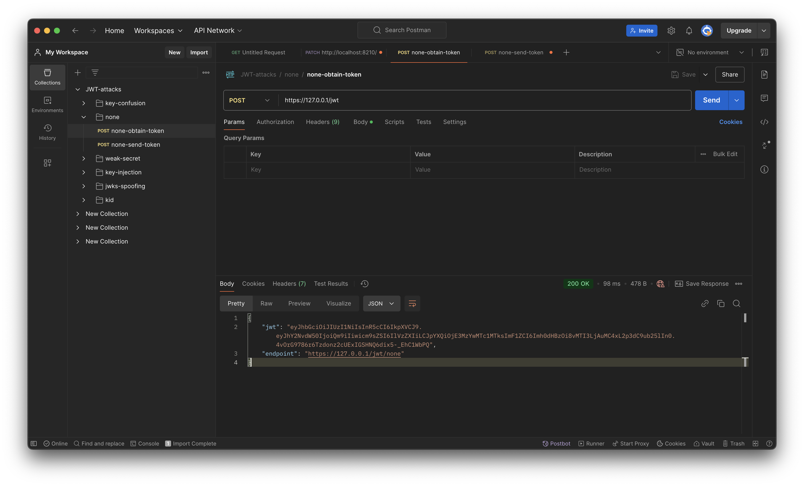
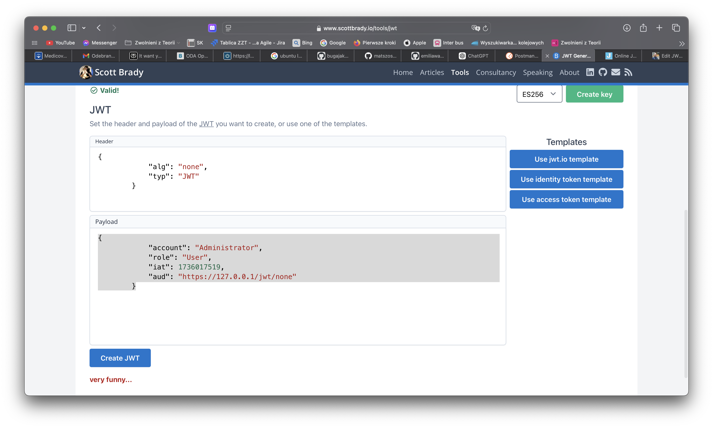
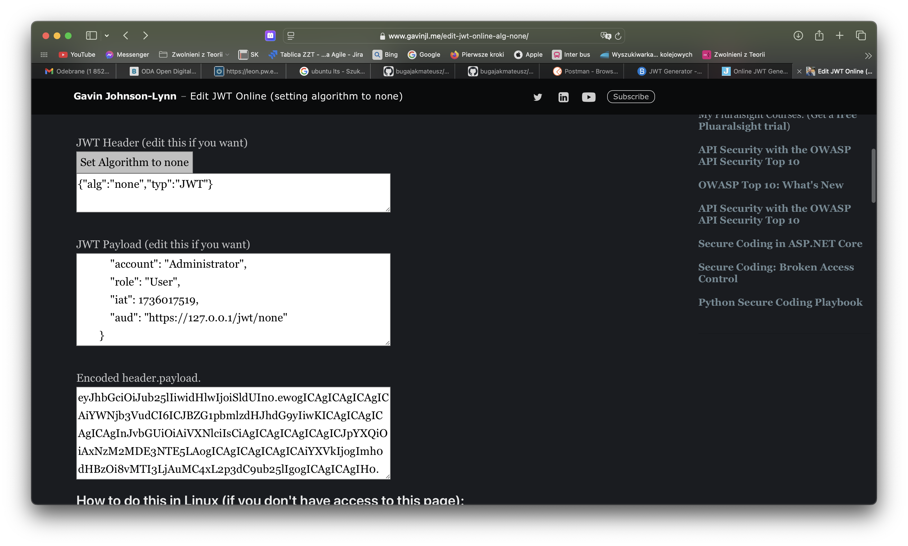
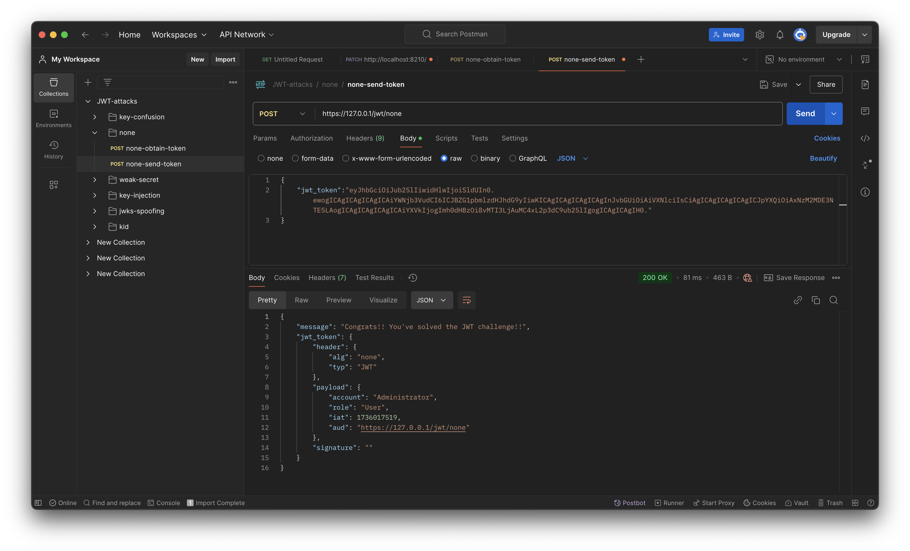
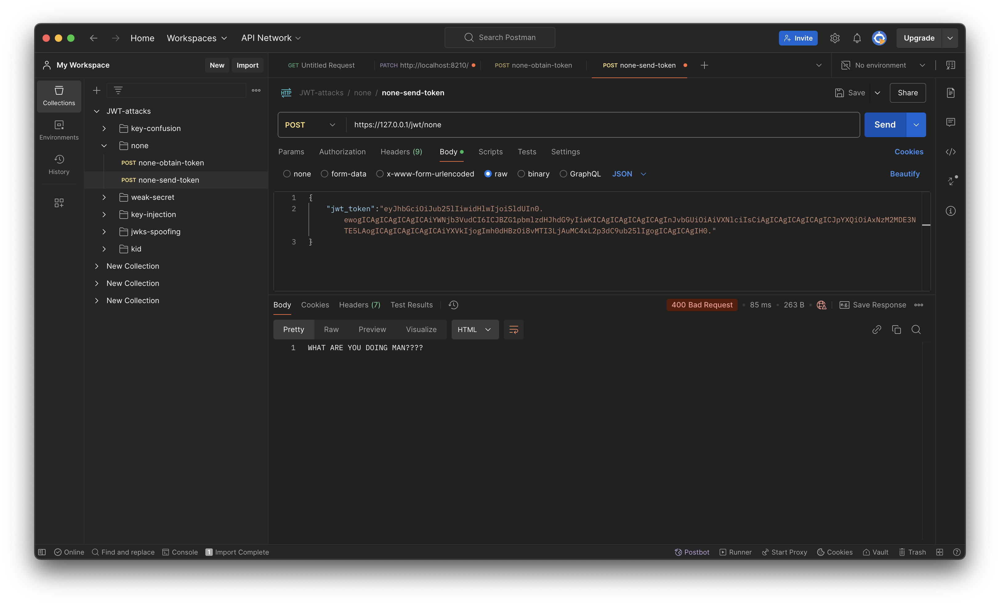

# Security By Design - Zadanie 3

## Zadanie 1 - Przygotowanie rozszerzonego zestawu testów jednostowych

Napisano testy dla modelu customers, uwzględniające zarówno 
- Testy poprawnych danych 
- Testy niepoprawnych danych
- Testy związane z próbą wstrzyknięcia kodu `SQL` i kodu `JavaScript`
- Testy ekstremalne

Zgodnie z oczekiwaniami, przy obecnej implementacji, testy **nie** przechodzą.

## Zadanie 2 - JWT — wykorzystanie podatności oraz realizacja poprawki

**Cel:** celem zadania jest zweryfikowanie i zidentyfikowanie podatności w module uwierzytelnienia aplikacji, realizowanego na podstawie wystawiane przez aplikacje tokeny `JWT`. Do realizacji będzie atak polegający na próbie zalogowania się na konto administratora. Po poprawnie zrealizowanym ataku należy znaleźć błąd w aplikacji, a następnie go usunąć.

### Wykonanie:

Zaimportowano kolekcję do Postmana, po czym wygenerowano token JWT dla użytkownika Bob.

Następnie przesłano token i odczytano jego treść.
Spróbowano utworzyć token JWT ze zmienionym payloadem oraz algorytmem *None*.
Skorzystano ze strony https://www.scottbrady.io/tools/jwt, niestety, była ona zabezpieczona przed tworzeniem tego typu ataków.

Skorzystano z dedykowanego rozwiązania - strony https://www.gavinjl.me/edit-jwt-online-alg-none/.

Przesłany token został poprawnie przyjęty.

Zaproponowano poprawkę zgodnie z poleceniem.
